 

*programmer — perfectionist, variable, chronically unfocused.*

---

---

<!-- 💻 TERMINAL BOOT SEQUENCE — animated GIF -->
<!-- Generated daily by .github/workflows/terminal.yml -->

  

---

<!-- ⚽ GITFUT — GitHub as a FIFA-style football card -->

  

---

<!-- ☢️ RBMK REACTOR — animated nuclear reactor of your activity -->

  

---

### 🔨 what i build

| Project | Description | Stack |
|---------|-------------|-------|
| **[latch](https://github.com/ArulGandhi/latch)** | Programming language & compiler — lexer → parser → type inference → TIR → VM + QBE/Cranelift |  |
| **[mcu-sim](https://github.com/ArulGandhi/mcu-sim)** | RP2040 simulator — Cortex-M0+ core, peripherals, runs real Pico SDK firmware |  |
| **[crawler](https://github.com/ArulGandhi/crawler)** | Concurrent web crawler — JS rendering, Tor routing, robots.txt, HTML→Markdown |  |
| **[authium](https://github.com/ArulGandhi/authium-cli)** | Secure TOTP 2FA manager — CLI/TUI |  |
| **[speedtools](https://github.com/ArulGandhi/speedtools)** | AST-based code-nav CLIs for Python & TypeScript |  |

### 🔓 what i break

| Target | Impact | Status |
|--------|--------|--------|
| **[SAFAL](https://arulgandhi.tech/writeups/safal-trust-secrets)** — CBSE assessment platform | Master password bypass → role escalation → plaintext credential dump → cross-school data access (25,000+ schools) |  |
| **[Excitel Router](https://arulgandhi.tech/writeups/excitel-router-issues)** — ISP home router | Firmware RE → root shell → hidden SSIDs, telemetry exfil, Chinese backdoor flags |  |
| **[DPS Wizzgeeks](https://arulgandhi.tech/writeups/dps-wizzgeeks-writeup)** — school portal | Blind NoSQL injection → deterministic account takeover from just an email |  |

---

<!-- 🐍 SNAKE — eats your contribution graph -->
<!-- Generated daily by .github/workflows/snake.yml -->
<picture>
  <source media="(prefers-color-scheme: dark)" srcset="./github-snake-dark.svg" />
  <source media="(prefers-color-scheme: light)" srcset="./github-snake.svg" />
  
</picture>

---

<!-- 📊 STATS — self-hosted via GitHub Actions, no Vercel -->
<!-- Generated daily by .github/workflows/stats.yml -->

  
  

---

 

